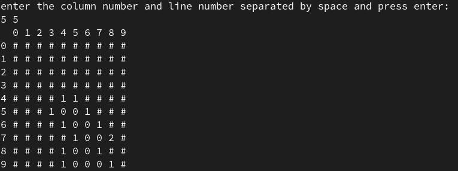

## Saper Game

### Overview
This implementation of the classic game "Saper" is written in GAS (GNU Assembly) in 32-bit mode.



### Usage
#### Prerequisites
Before cloning and building the project, ensure you have the necessary libraries for building applications in 32-bit mode, such as glibc, libgcc, etc. If you are using Fedora Linux, you can install them with the following command:
```bash
sudo dnf install glibc-devel.i686 glibc.i686 libgcc.i686

#### Steps to Build and Run
1. Clone the repository locally:
   - `git clone https://github.com/Myrrrca/saper`
2. Use the Makefile commands to build the executable:
   - `make saper` (to build)
   - `make clean` (to remove the executable)
3. Once built successfully, run the following command:
   - `./saper`
4. Simply type the column number and line number separated by space and press enter to make your guess

#### Features
[x]  Random field generation
[x]  Recursive opening of empty cells
[x]  You can actually win or lose
[ ]  Displaying neighboring mines horizontally (I forgot that this rule exists -_-)
[ ]  The ability to put "flags" on any cells to mark potential mines

#### Additional Information
- Please report any bugs or issues on the project's GitHub Issues page (https://github.com/Myrrrca/saper), providing  details of an issue

